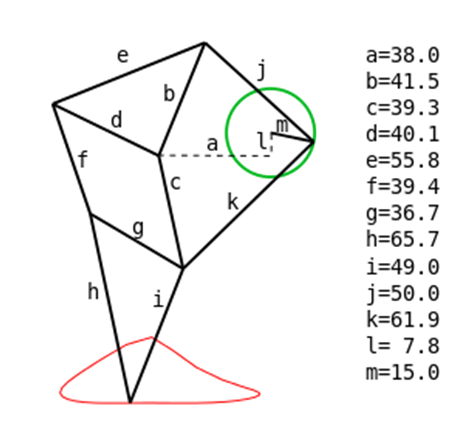
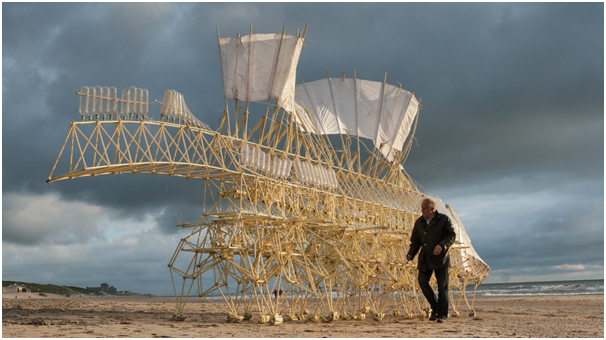

#### Objective :

To visualise Jansen walking mechanism and identify the four bar mechanisms present in it.

#### Pre Requisites :

Kinematic analysis of four bar mechanism

#### Theory :

Fig 1

Jansen mechanism consists of 11 links connected in tandem to each other to simulate a walking mechanism which is quite similar to that seen in crabs. It is a result of evolutionary computed models which Theo Jansen started to work upon in 1990. Out of all the links, one particular link acts as the rotational input which results in the walking motion of the entire linkage. The links synchronize together to trace an ecliptic trajectory which gets sharpened at the moment when the leg touches the ground. When two Jansen linkages are connected to each other by a rotating horizontal shaft, both the legs help the machine to move forward or backward depending on the clockwise or anticlockwise rotation of the shaft. This is closely comparable to a wheeled arrangement in cars where two wheels are connected on both sides of a rotating axle and the shaft rotates by 120 degrees per stride. Interestingly, the relationship of the hind limb with the fore limb is antiphase, thus helping them to move forward cooperatively. The parallel link in the Jansen linkage helps the linkage to attain the required step height by folding during the cycle angling of the leg.

The central 'crank' link moves in circles as it is actuated by a rotary actuator such as an electric motor. All other links and pin joints are unactuated and move because of the motion imparted by the crank. Their positions and orientations are uniquely defined as shown in Fig 1 by specifying the crank angle and hence the mechanism has only one degree of freedom (1-DoF).

Shown below is 'Strandbeest', a structure made up of Jansen linkages, constructed by Jansen. The structure is powered by wind using the sails.

Jansen mechanism consists of three 4 bar mechanisms-

1. Links m-k-c-a. where a is the fixed link (refer Fig1)

2. Links m-j-b-a

3. Links d-c-g-f

The link g-h-i is the foot of the mechanism.

The following links are helpful in understanding working of Jansen walking mechanism

- [Four-Legged Theo Jansen "Strandbeest" Walking Mechanism](http://scottburns.us/walking-mechanism/)

- [Dynamic Analysis and Modeling of Jansen Mechanism](https://ac.els-cdn.com/S1877705813017529/1-s2.0-S1877705813017529-main.pdf?_tid=2aedaa77-7fda-4aef-874c-5a4484afaa7c&acdnat=1523885032_535e5a438b4b91674b90eb692bd520cc)
